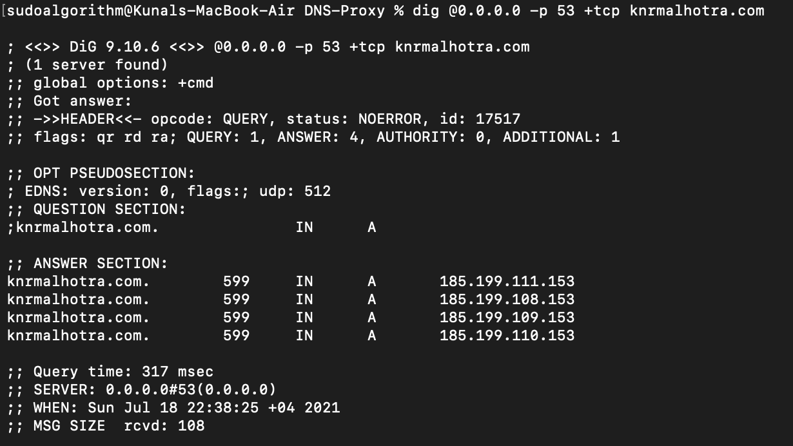

# DNS Proxy 

### Implementation

- Service Architecture Decisions

1. Google's dns over tls is used for quering the client requests.
2. Code is written in Python 3.7
3. Python standard Libraries used:-
    - socket: To create socket object
    - ssl: To facilate the TLS connection
    - os: Interact with the underlying os to get environment variables
    - logging: to log message
    - binascii: convert binary to Hexadecimal conversion
4. Connection from the client to proxy and proxy to destination google's dns server are seperate process.
5. python:3.7-alpine image is used as the base image for the proxy container

- Implementation Details

1. First we create tcp server which listens on port **53**. Once the tcp server start it start listening to requests to on 53.
2. After the tcp server start and requests(data) are recevied from they redirect to the destination googles dns running on host **dns.google** on port **853** to resolved and response is sent back to the client via tcp server we created in the previous step.
3. Some operations are done on requests(data) i.e converted from bytes to hex before the response is returned back to the client.
4. TCP Server can listen upto 5 connections cuncurrently.
5. A self-signed certified is generated to facilate the tls connection.

- Result



### Questions

- Question 1: Imagine this proxy being deployed in an infrastructure. What would be the security concerns you would raise?
- Answer 1: First, in the above architecture, Proxy above is a single point for the client applications to communicate with destination dns server, compromisation (man-in the middle between client and proxy can reveal the destination of the proxy server) of the infrastructure will open gate for all the client applications getting compromised. Second, SSL connections itself have been compromised in the past so we probably need to decide on the certificate cipher more carefully. Third, our destination dns server could also be compromised (unlikely but can happen).

- Question 2: How would you integrate that solution in a distributed,microservices-orientedand containerized architecture?
- Answers 2: First, the proxy server will be deployed in HA configuration i.e three instance of services at every point in time, so that even if one of the container dies there are other to handle the requests. Second, each container will be attached with it own storage, not shared so that logs from each instance can be storage and analysed independently if needed. If deployed in kubernetes horizontal pod autoscaling will be configured so that at time of application scaling, each proxy are there to handle the traffic. Proxy will be also be deployed as a deamon-set in kubernetes so that each nodes dosen't have to fight to get connections. 

- Question 3: What other improvements do you think would be interesting to add to the project?
- Answer 3: I would for sure add a caching service to cache the response, so that if the same request is made again, we don't to make requests to destination dns server to get the response. I would also introduce Mutli-threading so that there is no limit on number of connections. If deployed in kubernetes/vm's, I would like a add a load balancer infront of add to first distrubte the load and second add other layer of secuirty.

### How to run

* If not running as a container

- First create a self signed certificate
```
openssl req -x509 -newkey rsa:4096 -keyout key.pem -out cert.pem -days 365
```
- Second add the absolute path of the certificate generatd to the python file on line 55.
- Third run the command below
``` 
sudo python3 proxy.py
```
Note: Sudo is needed to used before the command because port 53 is previlaged port and admin access is required to run any application on it

* if running as the container
- Build the docker container
```
docker build -t proxy:v1 . --no-cache
```
- Run the container
```
docker run -d --name proxy -p 53:53 proxy:v1
```

* Testing

- Once the container or programe is running, run this command from any other terminal on same host
```
dig @0.0.0.0 -p 53 +tcp knrmalhotra.com
```
